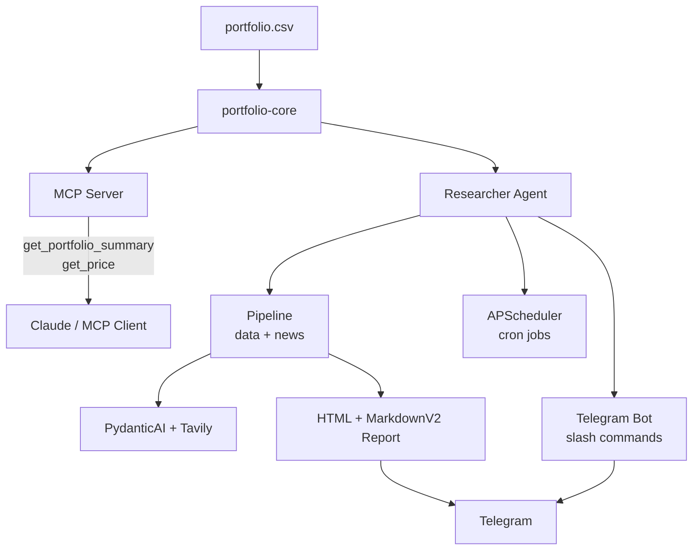

[繁體中文版](README.zh-TW.md)

# portfolio-mcp

An automated investment portfolio system that combines an MCP server for Claude, a Telegram bot, and AI-powered scheduled research — all built on a shared Python portfolio library.

## Features

- **MCP Tools for Claude** — expose `get_portfolio_summary` and `get_price` tools so Claude can query your live portfolio directly
- **Telegram Bot** — interact with your portfolio via slash commands (`/holdings`, `/watchlist`, `/alert`, `/research`, `/status`)
- **AI-Powered Research** — PydanticAI + Tavily search generates market news summaries and thesis updates
- **Scheduled Workflows** — premarket briefings, daily P&L reports, midday US alerts, and weekly reviews run automatically
- **Multi-Currency P&L** — tracks TWD and USD positions separately with no FX conversion, reporting totals per currency
- **Graceful Degradation** — failed price fetches are reported in `errors` without crashing the pipeline; news failures fall back to defaults

## Architecture



## Quick Start

### Prerequisites

- Python 3.13+
- [uv](https://docs.astral.sh/uv/) package manager
- A Telegram bot token and chat ID
- Google Gemini API key (for AI research)
- Tavily API key (for news search)

### Setup

```bash
git clone <repo-url>
cd portfolio-mcp
uv sync
```

Copy your environment variables:

```bash
cp .env.example .env   # or create .env manually
```

Minimum required variables:

```env
PORTFOLIO_CSV_PATH=./portfolio.csv
TELEGRAM_BOT_TOKEN=<your-token>
TELEGRAM_CHAT_ID=<your-chat-id>
GOOGLE_API_KEY=<your-gemini-key>
TAVILY_API_KEY=<your-tavily-key>
```

### Run the MCP Server

```bash
uv run --package mcp-server python mcp-server/server.py
```

Configure your MCP client (e.g. Claude Desktop) to point to this server. See `.mcp.json.example` for reference.

### Run the Telegram Bot + Scheduler

```bash
uv run --package researcher python -m researcher
```

## Scheduled Workflows

| Workflow | Schedule | Description |
|----------|----------|-------------|
| TW Premarket | Weekdays 08:30 Asia/Taipei | TW market research and alerts |
| US Premarket | Weekdays 08:30 America/New_York | US market research and alerts |
| TW Daily Summary | Weekdays 13:35 Asia/Taipei | Full portfolio P&L + news report |
| US Midday | Weekdays 13:00 America/New_York | US price alerts and thesis check |
| US Daily Summary | Weekdays 16:00 America/New_York | Full portfolio P&L + news report |
| Weekly Review | Saturdays 10:00 Asia/Taipei | Weekly portfolio reflection |

## Tech Stack

| Layer | Technology |
|-------|-----------|
| Language | Python 3.13 |
| Package manager | uv (workspace) |
| MCP server | FastMCP |
| AI research | PydanticAI + Google Gemini |
| News search | Tavily |
| Price data | yfinance |
| Telegram | python-telegram-bot 21 |
| Scheduling | APScheduler 3 |
| Formatter | Ruff |
