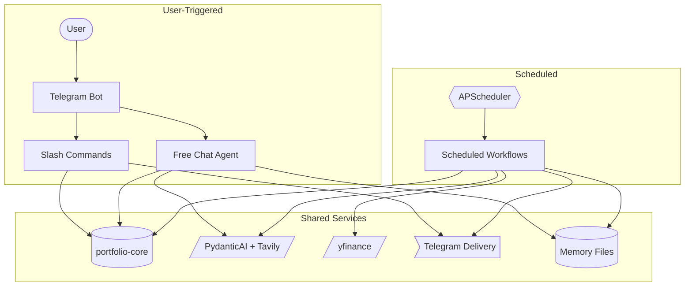

[繁體中文版](README.zh-TW.md)

# portfolio-mcp

An automated investment portfolio system that combines an MCP server for Claude, a Telegram bot, and AI-powered scheduled research — all built on a shared Python portfolio library.

## Features

- **MCP Tools for Claude** — expose `get_portfolio_summary` and `get_price` tools so Claude can query your live portfolio directly
- **Telegram Bot** — interact with your portfolio via slash commands (`/holdings`, `/watchlist`, `/alert`, `/research`, `/status`) and free-form multi-turn chat
- **AI Chat Agent** — conversational assistant with access to live portfolio, watchlist, research history, and web search; conversation is persisted turn-by-turn so context survives session resets
- **AI-Powered Research** — PydanticAI + Tavily search generates market news summaries and thesis updates
- **Scheduled Workflows** — premarket briefings, daily P&L reports, midday US alerts, and weekly reviews run automatically
- **Multi-Currency P&L** — tracks TWD and USD positions separately with no FX conversion, reporting totals per currency
- **Graceful Degradation** — failed price fetches are reported in `errors` without crashing the pipeline; news failures fall back to defaults

## Architecture



## Quick Start

### Prerequisites

- Python 3.13+
- [uv](https://docs.astral.sh/uv/) package manager
- A Telegram bot token and chat ID
- Google Gemini API key (for AI research)
- Tavily API key (for news search)

### Setup

```bash
git clone <repo-url>
cd portfolio-mcp
uv sync
cp mcp-server/portfolio-example.csv portfolio.csv  # edit with your holdings
```

Create a `.env` file with the required variables listed below:

Minimum required variables:

```env
PORTFOLIO_CSV_PATH=./portfolio.csv
TELEGRAM_BOT_TOKEN=<your-token>
TELEGRAM_CHAT_ID=<your-chat-id>
GOOGLE_API_KEY=<your-gemini-key>
TAVILY_API_KEY=<your-tavily-key>
```

Optional (have working defaults):

```env
WATCHLIST_CSV_PATH=./watchlist.csv
PRICE_ALERTS_PATH=./price-alerts.yml
RESEARCHER_MEMORY_PATH=./memory
```

### Run the MCP Server

```bash
uv run --package mcp-server python mcp-server/server.py
```

Configure your MCP client (e.g. Claude Desktop) to point to this server using stdio transport.

For architecture details, testing patterns, and how to add workflows, see [DEVELOPMENT.md](DEVELOPMENT.md).

### Run the Telegram Bot + Scheduler

```bash
uv run --package researcher python -m researcher
```

## Scheduled Workflows

| Workflow | Schedule | What it does | Sends Telegram? |
|----------|----------|--------------|-----------------|
| TW Premarket | Weekdays 08:30 Asia/Taipei | Reads investment strategy + last 3 research log entries; searches macro indicators and per-ticker news via Tavily; classifies alert tickers | Only if alert tickers found |
| US Premarket | Weekdays 08:30 America/New_York | Same as TW Premarket, filtered to USD positions and US watchlist | Only if alert tickers found |
| TW Daily Summary | Weekdays 13:35 Asia/Taipei | Batch-fetches current prices and day P&L; reads today's pre-market and midday research from `RESEARCH-LOG.md`; uses AI to cross-reference forecasts with actual close prices; formats and sends full portfolio report; appends `Close Insight` to `RESEARCH-LOG.md` | Always |
| US Midday | Weekdays 13:00 America/New_York | Loads `price-alerts.yml`; checks threshold breaches and >2% intraday moves; runs per-ticker AI thesis check if triggered | Only if price alert or thesis broken |
| US Daily Summary | Weekdays 16:00 America/New_York | Same as TW Daily Summary, filtered to US and crypto positions | Always |
| Weekly Review | Saturdays 10:00 Asia/Taipei | Reads last 10 entries from portfolio + research logs; fetches SPY and 0050.TW benchmark returns; generates weekly reflection via AI | Always |

## Telegram Bot

### Commands

| Command | Subcommands | Description |
|---------|-------------|-------------|
| `/status` | — | Confirms the agent is running |
| `/watchlist` | `list` / `add TICKER [note]` / `remove TICKER` | Manage watchlist entries |
| `/alert` | `show [TICKER]` / `set TICKER above=X` / `set TICKER below=X` | View or configure price alert thresholds |
| `/holdings` | `update TICKER SHARES COST` | Update a position in `portfolio.csv` |
| `/research` | `[TW\|US]` (default US) | Trigger a premarket research run on demand |
| `/newchat` | — | Reset the in-memory conversation thread (past exchanges remain in `CHAT-LOG.md`) |

### Free-form Chat

Any non-command message is handled by a multi-turn chat agent. Conversation history is maintained per-user in memory and every exchange is immediately appended to `CHAT-LOG.md`, so context is never lost across bot restarts or `/newchat` resets.

The agent has access to the following tools:

| Tool | What it retrieves |
|------|-------------------|
| `get_portfolio` | Live holdings and performance summary |
| `get_watchlist` | Current watchlist entries |
| `read_chat_log` | Recent conversation history from `CHAT-LOG.md` |
| `read_research_log` | Premarket / midday / weekly research notes |
| `read_strategy` | Investment strategy document |
| `save_note` | Saves an explicit insight to `RESEARCH-LOG.md` |
| Web search | Live news via Tavily (requires `TAVILY_API_KEY`) |

Use `/newchat` to start a fresh conversation thread. The agent can still recall past topics by calling `read_chat_log`.

## Memory System

The researcher accumulates context across runs using four append-only markdown files under `RESEARCHER_MEMORY_PATH` (default `./memory`):

| File | Written by | Read by |
|------|-----------|---------|
| `INVESTMENT-STRATEGY.md` | You (manually) | Premarket, Chat agent — grounds research in your stated strategy |
| `RESEARCH-LOG.md` | Premarket, Midday, Daily Summary (`Close Insight`), Weekly Review, Chat (`save_note`) | All agents — last 2–3 entries for rolling context |
| `PORTFOLIO-LOG.md` | Daily Summary | Weekly Review — last 10 entries for performance context |
| `WEEKLY-REVIEW.md` | Weekly Review | — |
| `CHAT-LOG.md` | Chat agent (every turn) | Chat agent — `read_chat_log` tool for cross-session recall |

Premarket and midday workflows use PydanticAI with Tavily for live news search. The daily close summary uses a no-Tavily analysis agent to cross-reference the day's research log with actual close prices. All agents use exponential-backoff retry on failure.

## Tech Stack

| Layer | Technology |
|-------|-----------|
| Language | Python 3.13 |
| Package manager | uv (workspace) |
| MCP server | FastMCP |
| AI research | PydanticAI + Google Gemini |
| News search | Tavily |
| Price data | yfinance |
| Telegram | python-telegram-bot 21 |
| Scheduling | APScheduler 3 |
| Formatter | Ruff |
