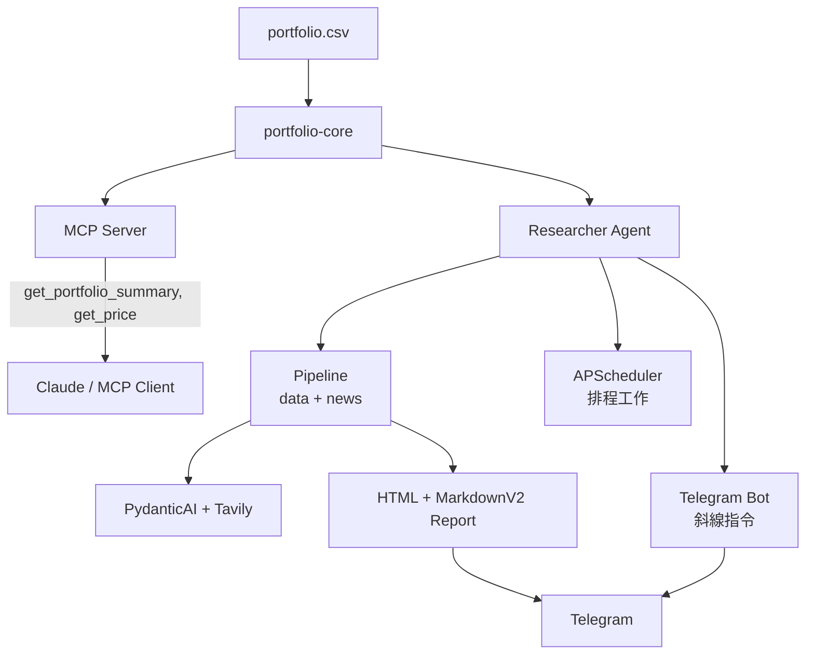

[English](README.md)

# portfolio-mcp

一個自動化的投資組合管理系統，結合了 MCP 伺服器（供 Claude 使用）、Telegram 機器人，以及 AI 驅動的排程研究功能——全部建構於共用的 Python 投資組合函式庫之上。

## 功能特色

- **Claude 的 MCP 工具** — 提供 `get_portfolio_summary` 和 `get_price` 工具，讓 Claude 可以直接查詢你的即時投資組合
- **Telegram 機器人** — 透過斜線指令與投資組合互動（`/holdings`、`/watchlist`、`/alert`、`/research`、`/status`）
- **AI 驅動的研究** — 使用 PydanticAI + Tavily 搜尋生成市場新聞摘要與論點更新
- **排程工作流程** — 盤前簡報、每日損益報告、美股盤中提醒及每週回顧自動執行
- **多幣別損益** — 分別追蹤台幣與美元部位，不進行外匯換算，按幣別分開報告合計
- **優雅降級** — 價格抓取失敗會記錄在 `errors` 中，不會中斷整個流程；新聞抓取失敗則退回預設值

## 系統架構



## 快速開始

### 前置需求

- Python 3.13+
- [uv](https://docs.astral.sh/uv/) 套件管理器
- Telegram 機器人 token 與聊天室 ID
- Google Gemini API 金鑰（用於 AI 研究）
- Tavily API 金鑰（用於新聞搜尋）

### 安裝設定

```bash
git clone <repo-url>
cd portfolio-mcp
uv sync
```

建立 `.env` 檔案並填入以下必要變數：

必要環境變數：

```env
PORTFOLIO_CSV_PATH=./portfolio.csv
TELEGRAM_BOT_TOKEN=<你的-token>
TELEGRAM_CHAT_ID=<你的-chat-id>
GOOGLE_API_KEY=<你的-gemini-金鑰>
TAVILY_API_KEY=<你的-tavily-金鑰>
```

選填（有預設值）：

```env
WATCHLIST_CSV_PATH=./watchlist.csv
PRICE_ALERTS_PATH=./price-alerts.yml
RESEARCHER_MEMORY_PATH=./memory
```

### 執行 MCP 伺服器

```bash
uv run --package mcp-server python mcp-server/server.py
```

設定你的 MCP 用戶端（例如 Claude Desktop）透過 stdio transport 指向此伺服器。

### 執行 Telegram 機器人 + 排程器

```bash
uv run --package researcher python -m researcher
```

## 排程工作流程

| 工作流程 | 排程 | 說明 |
|----------|------|------|
| 台股盤前 | 平日 08:30 Asia/Taipei | 台股市場研究與提醒 |
| 美股盤前 | 平日 08:30 America/New_York | 美股市場研究與提醒 |
| 台股每日摘要 | 平日 13:35 Asia/Taipei | 完整投資組合損益 + 新聞報告 |
| 美股盤中 | 平日 13:00 America/New_York | 美股價格提醒與論點確認 |
| 美股每日摘要 | 平日 16:00 America/New_York | 完整投資組合損益 + 新聞報告 |
| 每週回顧 | 週六 10:00 Asia/Taipei | 每週投資組合反思 |

## 技術棧

| 層級 | 技術 |
|------|------|
| 程式語言 | Python 3.13 |
| 套件管理 | uv（workspace） |
| MCP 伺服器 | FastMCP |
| AI 研究 | PydanticAI + Google Gemini |
| 新聞搜尋 | Tavily |
| 價格資料 | yfinance |
| Telegram | python-telegram-bot 21 |
| 排程 | APScheduler 3 |
| 格式化 | Ruff |
