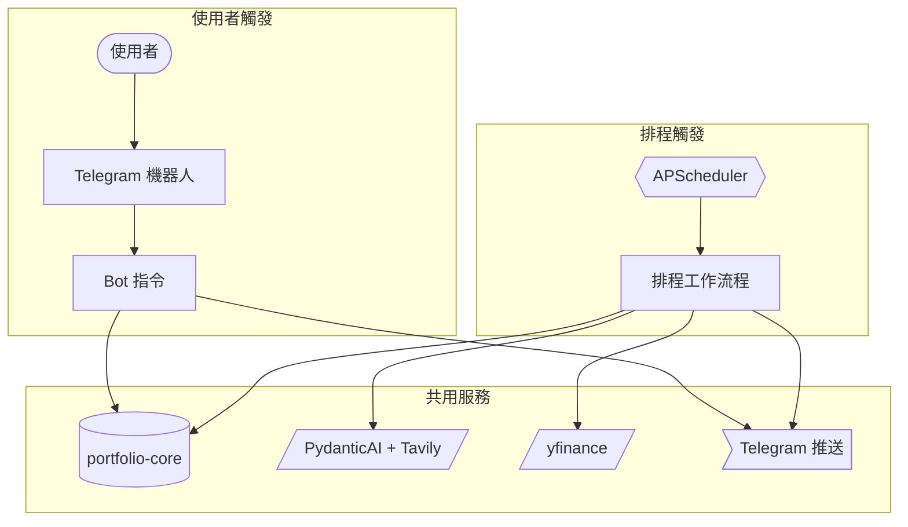

[English](README.md)

# portfolio-mcp

一個自動化的投資組合管理系統，結合了 MCP 伺服器（供 Claude 使用）、Telegram 機器人，以及 AI 驅動的排程研究功能——全部建構於共用的 Python 投資組合函式庫之上。

## 功能特色

- **Claude 的 MCP 工具** — 提供 `get_portfolio_summary` 和 `get_price` 工具，讓 Claude 可以直接查詢你的即時投資組合
- **Telegram 機器人** — 透過斜線指令與投資組合互動（`/holdings`、`/watchlist`、`/alert`、`/research`、`/status`）
- **AI 驅動的研究** — 使用 PydanticAI + Tavily 搜尋生成市場新聞摘要與論點更新
- **排程工作流程** — 盤前簡報、每日損益報告、美股盤中提醒及每週回顧自動執行
- **多幣別損益** — 分別追蹤台幣與美元部位，不進行外匯換算，按幣別分開報告合計
- **優雅降級** — 價格抓取失敗會記錄在 `errors` 中，不會中斷整個流程；新聞抓取失敗則退回預設值

## 系統架構



## 快速開始

### 前置需求

- Python 3.13+
- [uv](https://docs.astral.sh/uv/) 套件管理器
- Telegram 機器人 token 與聊天室 ID
- Google Gemini API 金鑰（用於 AI 研究）
- Tavily API 金鑰（用於新聞搜尋）

### 安裝設定

```bash
git clone <repo-url>
cd portfolio-mcp
uv sync
cp mcp-server/portfolio-example.csv portfolio.csv  # 依實際持倉填寫
```

建立 `.env` 檔案並填入以下必要變數：

必要環境變數：

```env
PORTFOLIO_CSV_PATH=./portfolio.csv
TELEGRAM_BOT_TOKEN=<你的-token>
TELEGRAM_CHAT_ID=<你的-chat-id>
GOOGLE_API_KEY=<你的-gemini-金鑰>
TAVILY_API_KEY=<你的-tavily-金鑰>
```

選填（有預設值）：

```env
WATCHLIST_CSV_PATH=./watchlist.csv
PRICE_ALERTS_PATH=./price-alerts.yml
RESEARCHER_MEMORY_PATH=./memory
```

### 執行 MCP 伺服器

```bash
uv run --package mcp-server python mcp-server/server.py
```

設定你的 MCP 用戶端（例如 Claude Desktop）透過 stdio transport 指向此伺服器。

架構說明、測試模式及如何新增工作流程，請參閱 [DEVELOPMENT.md](DEVELOPMENT.md)。

### 執行 Telegram 機器人 + 排程器

```bash
uv run --package researcher python -m researcher
```

## 排程工作流程

| 工作流程 | 排程 | 執行內容 | 發送 Telegram？ |
|----------|------|----------|-----------------|
| 台股盤前 | 平日 08:30 Asia/Taipei | 讀取投資策略 + 最近 3 筆研究記錄；透過 Tavily 搜尋總經指標與個股新聞；分類需警示的標的 | 僅在發現警示標的時 |
| 美股盤前 | 平日 08:30 America/New_York | 同台股盤前，篩選 USD 部位與美股觀察清單 | 僅在發現警示標的時 |
| 台股每日摘要 | 平日 13:35 Asia/Taipei | 批次抓取現價與當日損益；執行 AI 新聞分析管線（總經、台股、加密貨幣）；格式化並發送完整投資組合報告 | 每次皆發送 |
| 美股盤中 | 平日 13:00 America/New_York | 讀取 `price-alerts.yml`；檢查價格閾值觸發與盤中漲跌幅 >2%；觸發時對個股執行 AI 論點確認 | 僅在觸發價格警示或論點破壞時 |
| 美股每日摘要 | 平日 16:00 America/New_York | 同台股每日摘要，篩選美股與加密貨幣部位 | 每次皆發送 |
| 每週回顧 | 週六 10:00 Asia/Taipei | 讀取最近 10 筆投資組合 + 研究記錄；抓取 SPY 與 0050.TW 基準績效；透過 AI 生成每週反思 | 每次皆發送 |

## Telegram 機器人

### 指令列表

| 指令 | 子指令 | 說明 |
|------|--------|------|
| `/status` | — | 確認代理正在運作 |
| `/watchlist` | `list` / `add TICKER [note]` / `remove TICKER` | 管理觀察清單 |
| `/alert` | `show [TICKER]` / `set TICKER above=X` / `set TICKER below=X` | 查看或設定價格警示閾值 |
| `/holdings` | `update TICKER SHARES COST` | 更新 `portfolio.csv` 中的持倉 |
| `/research` | `[TW\|US]`（預設 US） | 手動觸發盤前研究 |

### 自由對話

任何非指令訊息都會由對話代理處理。代理可取得今日日期與 `RESEARCH-LOG.md` 最近 2 筆記錄作為上下文——**無法**存取即時持倉資料或現價。意圖分為三種：

- **command**（指令）— 建議對應的斜線指令（例如 `/watchlist add AAPL`）
- **research**（研究）— 透過 Tavily 搜尋新聞，以 3–5 句回答
- **other**（其他）— 禮貌性對話回覆

## 記憶系統

Researcher 透過四個只能附加的 Markdown 檔案在執行之間累積上下文，路徑由 `RESEARCHER_MEMORY_PATH`（預設 `./memory`）控制：

| 檔案 | 由誰寫入 | 由誰讀取 |
|------|----------|----------|
| `INVESTMENT-STRATEGY.md` | 手動編輯 | 盤前工作流程——讓研究紮根於你的投資策略 |
| `RESEARCH-LOG.md` | 盤前、盤中、每週回顧 | 所有代理——取最近 2–3 筆作為滾動上下文 |
| `PORTFOLIO-LOG.md` | 每日摘要 | 每週回顧——取最近 10 筆評估績效 |
| `WEEKLY-REVIEW.md` | 每週回顧 | — |

所有研究工作流程透過 PydanticAI 驅動，以 Tavily 進行即時新聞搜尋，並在失敗時自動指數退避重試。

## 技術棧

| 層級 | 技術 |
|------|------|
| 程式語言 | Python 3.13 |
| 套件管理 | uv（workspace） |
| MCP 伺服器 | FastMCP |
| AI 研究 | PydanticAI + Google Gemini |
| 新聞搜尋 | Tavily |
| 價格資料 | yfinance |
| Telegram | python-telegram-bot 21 |
| 排程 | APScheduler 3 |
| 格式化 | Ruff |
